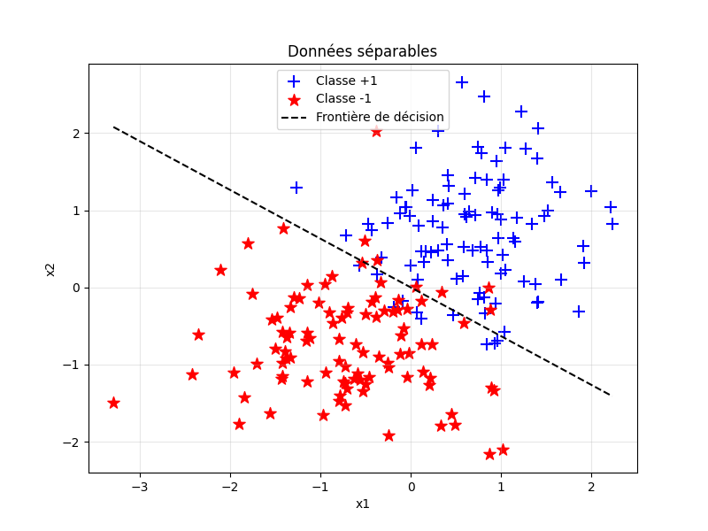
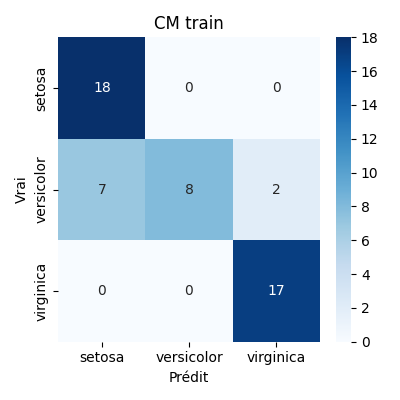

lien du tp : https://sleek-think.ovh/enseignement/neural-network-perceptron/ 

Voir README.md dans TP2 pour le rapport du 2eme TP

TP 1

## Objectifs du TP

- Comprendre le fonctionnement du perceptron simple  
- Implémenter l’algorithme du perceptron  
- Analyser les limites du perceptron sur des problèmes non-linéairement séparables  
- Appliquer le perceptron à des données réelles  

## Livrables attendus

### 1. Code

- Implémentation complète de la classe **PerceptronSimple**  
- Implémentation de la classe **PerceptronMultiClasse**  
- Scripts de test et de visualisation  

### 2. Rapport

- **Introduction** : Contexte et objectifs  
- **Méthodes** : Description des algorithmes implémentés  
- **Résultats** :  
  - Tests sur fonctions logiques  
  - Analyse de convergence  
  - Évaluation sur données réelles  
- **Discussion** :  
  - Limites du perceptron  
  - Cas d’usage appropriés  
- **Conclusion** : Synthèse des apprentissages  

### 3. Visualisations

- Graphiques de convergence  
- Visualisation des droites de séparation  
- Matrices de confusion  
- Comparaisons de performances  

Voir ci dessous le rapport demandé et voir dans REP_QUESTIONS.txt les réponses au questions des exercices

-----------------------------
---------- RAPPORT ----------
-----------------------------

### Introduction

Le fichier README.md rappelle les objectifs pédagogiques du projet : comprendre le fonctionnement du perceptron, l’implémenter et analyser ses limites, puis appliquer l’algorithme sur des données réelles.

### Méthodes

Le perceptron simple initialise un vecteur de poids aléatoire, puis itère sur les exemples pour ajuster les poids et le biais en fonction de l’erreur de prédiction. La prédiction utilise la fonction de Heaviside pour renvoyer une sortie binaire (0 ou 1).

Le perceptron multi-classe applique la stratégie « un-contre-tous » : un perceptron binaire est entraîné pour chaque classe, et la classe prédite est celle ayant le score maximal parmi tous les modèles.

Des scripts annexes permettent de générer des données linéairement séparables et d’étudier la convergence de l’apprentissage selon différents taux d’apprentissage.

L’évaluation avancée repose sur la séparation des données en ensembles d’entraînement, de validation et de test. Elle utilise un mécanisme d’early stopping basé sur partial_fit et la sauvegarde des meilleurs poids.

### Résultats

Le fichier PerceptronSimple.py inclut un jeu de tests sur les fonctions logiques AND, OR et XOR, affichant le score final et le nombre d’époques nécessaires à la convergence.

Le script de génération de données séparables affiche la performance finale du perceptron et visualise la frontière de décision apprise.

Le perceptron multi-classe dispose d’un test de base mesurant l’accuracy sur un jeu de données synthétiques à trois classes.

Le script d’évaluation génère des matrices de confusion et un rapport de classification détaillé (train/val/test), mais certaines méthodes nécessaires (partial_fit, get_weights, set_weights) ne sont pas encore implémentées.

### Discussion

Les résultats confirment les limites théoriques du perceptron : il échoue lorsque les données ne sont pas linéairement séparables (comme le montre l'exemple de XOR), et il est sensible au bruit ainsi qu’au déséquilibre des classes. Pour pallier ces limites, plusieurs pistes peuvent être envisagées :

La normalisation des données en entrée

L’ajout de couches cachées pour traiter des problèmes non linéaires (ex. : réseau de neurones multicouche) 

Une attention particulière portée à l’initialisation aléatoire des poids et au choix du taux d’apprentissage.

### Conclusion

Ce projet a permis de comprendre le perceptron, ses principes et ses limites. S’il fonctionne bien sur des données linéaires, il échoue dès que le problème devient non linéaire ou bruité. L’analyse a aussi souligné l’importance du taux d’apprentissage et de l’évaluation sur plusieurs ensembles. Pour aller plus loin, l’ajout de couches cachées ou l’usage d’outils plus avancés comme Scikit-learn pourrait être envisagé.

# Exercices Perceptron – Résumés & Réponses

## Exercice 1

## Exercice 2

- **Pourquoi la fonction de Heaviside c'est pas top pour l'apprentissage par gradient ?**  
  Elle est pas dérivable et sa dérivée est nulle quasi partout. Du coup, impossible de propager le gradient, ce qui bloque tout l’apprentissage avec les méthodes classiques genre descente de gradient.

- **Quand utiliser sigmoid ou tanh ?**  
  - **Sigmoid** : utile en sortie pour donner des probabilités, vu qu’elle donne un truc entre 0 et 1.  
  - **Tanh** : mieux dans les couches cachées parce qu’elle est centrée sur 0 (entre -1 et 1), ça aide à mieux apprendre.

- **Pourquoi ReLU est-elle si kiffée dans les gros réseaux ?**  
  Elle est super simple à calculer, et évite que le gradient disparaisse comme avec sigmoid. En plus, elle accélère souvent la convergence.

- **C’est quoi le bon côté du leaky ReLU ?**  
  Le leaky ReLU laisse passer un mini gradient même quand l’entrée est négative. Du coup, ça évite que des neurones "meurent" (ils apprennent plus rien).

---

## Exercice 3

- **Si $\eta$ est trop grand, ça donne quoi ?**  
  - Le perceptron fait le yoyo, il saute autour de la bonne solution sans jamais s’y poser.  
  - Parfois il apprend plus rien du tout, ça diverge.  
  - Il peut juste passer à côté de la solution sans la voir.

- **Et si $\eta$ est trop petit ?**  
  - Alors là, c’est super lent. Il apprend mais faut être patient.  
  - Parfois il s’arrete trop tôt.  
  - Mais c’est stable, t’as le temps de faire une pause café entre deux epochs.

- **Y a-t-il une valeur magique pour $\eta$ ?**  
  Non pas vraiment. En général on tape dans du 0.01 à 0.2, mais ça dépend du dataset.

- **On peut changer $\eta$ en cours de route ?**  
  Ouais ! Tu commences avec un gros $\eta$ pour aller vite, puis tu le diminues pour mieux ajuster.

- **Une idée de stratégie ?**  
  Baisser $\eta$ à chaque itération (learning rate decay). Rapide au début, précis à la fin.

---

## Exercice 5

- **Combien d’époques pour que ça converge ?**  
  Avec des poids initiaux au pif, il a fallu 11 époques (soit 18 échantillons traités) pour converger (AND).

- **Le perceptron converge-t-il toujours vers la même solution ?**  
  Si tu utilises les mêmes poids au départ, tu retrouves la même solution.

---

## Exercice 6

- **Constatation ?**  
  Le perceptron ne converge pas. Pas possible de tracer une droite qui sépare correctement les classes.

- **Lien avec la séparabilité linéaire ?**  
  Si les classes sont pas séparables avec une droite, alors le perceptron est useless. Faut un réseau plus complexe (au moins une couche cachée).

---

## Exercice 7

## Exercice 8

- **Taux d’apprentissage très petit ?**  
  Le perceptron apprend trèèès lentement. Genre avec 0.0001 ou 0.001, ça finit par marcher, mais c’est long.

- **Taux d’apprentissage trop grand ?**  
  À partir de 0.1, ça devient instable. Il saute partout et trouve pas la bonne solution.

- **Y a un taux d’apprentissage idéal ?**  
  Ouais, dans mon cas c’est 0.001. Pas trop lent, pas trop instable.

- **Influence du bruit et de la dispersion ?**  
  Trop de bruit = trop de dispersion = apprentissage difficile, surtout avec un taux trop élevé.

---

## Exercice 9

- **Plusieurs perceptrons prédisent "oui" ?**  
  C’est flou. Faut une règle pour décider. Genre prendre celui qui est le plus "confiant".

- **Aucun perceptron ne prédit "oui" ?**  
  Soit tu dis que l’exemple est "inconnu", soit tu fais un truc plus soft avec les scores.

- **Déséquilibre entre classes ?**  
  Les classes peu présentes se font oublier. Faut rééchantillonner ou ajuster les poids.

---

## Exercice 11

- **Quand le perceptron converge-t-il ?**  
  Quand les données sont bien séparables linéairement. Sinon, c’est pas garanti.

- **Poids initiaux = importants ?**  
  Oui, surtout si les données sont pas top. Mauvaise initialisation = mauvaise convergence.

- **Comment choisir le bon taux d’apprentissage ?**  
  Test, visualise, ajuste. Et pourquoi pas le faire évoluer pendant l’entraînement ?

- **Comment tester la généralisation ?**  
  Utilise une validation croisée. Tu sépares ton jeu de données et tu testes sur des données jamais vues.

- **Pour le XOR, une idée ?**  
  Faut un réseau plus balèze. Un perceptron seul peut pas faire ça.

- **Et si les données sont bruitées ?**  
  Si c’est léger, ça va. Si c’est trop, le perceptron va juste faire ce qu’il peut (pas ouf).

- **Et une classe minoritaire ?**  
  Il va la zapper. Faut l’aider un peu (oversampling, poids...).

- **Normalisation ?**  
  Oui oui oui. Toujours normaliser. Sinon les poids peuvent déconner et ralentir l’apprentissage.

---

